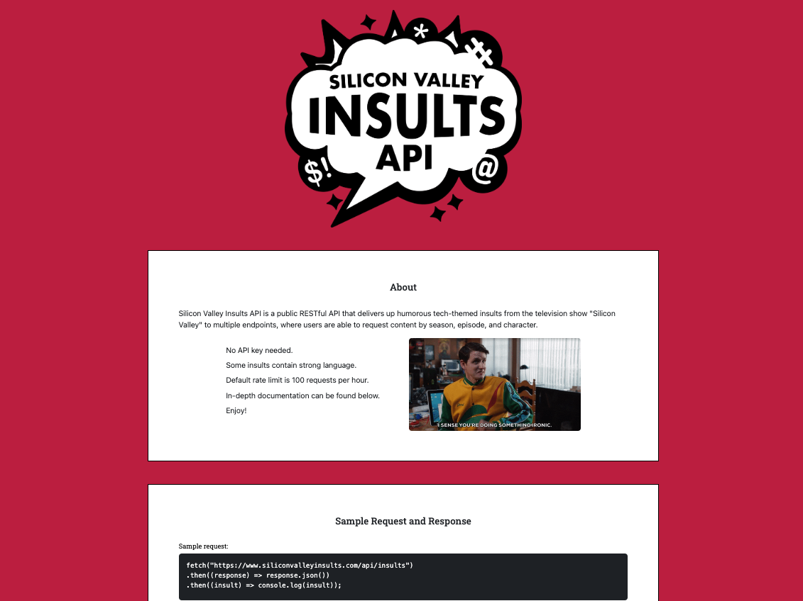

# Silicon Valley Insults API

Silicon Valley Insults API is a public RESTful API that delivers humorous tech-themed insults from the television show "Silicon Valley" to multiple endpoints, allowing users to request content by season, episode, and character.

## Sample Request and Response

**Sample Request:**

```javascript
fetch("https://www.siliconvalleyinsults.com/api/insults")
.then((response) => response.json())
.then((insult) => console.log(insult));
```

**Sample Response:**

```json
{
    "season": 1,
    "episode": 2,
    "character": "Gavin",
    "insult": "I hate Richard Hendricks, that little Pied Piper prick."
}
```
## Screenshot



## API Endpoints

### Get a random insult

**Method:** GET
**Path:** /api/insults

**Sample Request:**

```javascript
fetch("https://www.siliconvalleyinsults.com/api/insults")
.then((response) => response.json())
.then((insult) => console.log(insult));
```

**Response format:**

```json
{
    "season": ...,
    "episode": ...,
    "character": "...",
    "insult": "..."
}
```

### Get a random insult by character

**Method:** GET
**Path:** /api/insults/character/{character}
**Parameters:** {character} is a string representing the first name of the character you want an insult from

**Sample Request:**

```javascript
fetch("https://www.siliconvalleyinsults.com/api/insults/character/jared")
.then((response) => response.json())
.then((insult) => console.log(insult));
```

**Sample Response format:**

```json
{
    "season": ...,
    "episode": ...,
    "character": "Jared",
    "insult": "..."
}
```

### Get a random insult by season

**Method:** GET
**Path:** /api/insults/season/{season}
**Parameters:** {season} is an integer representing the season you want an insult from

**Sample Request:**

```javascript
fetch("https://www.siliconvalleyinsults.com/api/insults/season/1")
.then((response) => response.json())
.then((insult) => console.log(insult));
```

**Sample Response format:**

```json
{
    "season": 1,
    "episode": ...,
    "character": "...",
    "insult": "..."
}
```

### Get a random insult by season and character

**Method:** GET
**Path:** /api/insults/season/{season}/character/{character}
**Parameters:** {season} is an integer representing the season, {character} is a string representing the character

**Sample Request:**

```javascript
fetch("https://www.siliconvalleyinsults.com/api/insults/season/1/character/erlich")
.then((response) => response.json())
.then((insult) => console.log(insult));
```

**Sample Response format:**

```json
{
    "season": 1,
    "episode": ...,
    "character": "Erlich",
    "insult": "..."
}
```

### Get a random insult by season and episode

**Method:** GET
**Path:** /api/insults/season/{season}/episode/{episode}
**Parameters:** {season} is an integer representing the season, {episode} is an integer representing the episode

**Sample Request:**

```javascript
fetch("https://www.siliconvalleyinsults.com/api/insults/season/1/episode/2")
.then((response) => response.json())
.then((insult) => console.log(insult));
```

**Sample Response format:**

```json
{
    "season": 1,
    "episode": 2,
    "character": "...",
    "insult": "..."
}
```

### Get a random insult by season, episode, and character

**Method:** GET
**Path:** /api/insults/season/{season}/episode/{episode}/character/{character}
**Parameters:** {season} is an integer representing the season, {episode} is an integer representing the episode, {character} is a string representing the character

**Sample Request:**

```javascript
fetch("https://www.siliconvalleyinsults.com/api/insults/season/1/episode/2/character/dinesh")
.then((response) => response.json())
.then((insult) => console.log(insult));
```

**Sample Response format:**

```json
{
    "season": 1,
    "episode": 2,
    "character": "Dinesh",
    "insult": "..."
}
```

## Errors and Exceptions

### Insult does not exist

The insult you request may not exist. For example, you may request an insult from Jared from Season 1 Episode 3 when no such insult exists in the database. In this case, you will receive the following exception:

**Sample Request:**

```javascript
fetch("https://www.siliconvalleyinsults.com/api/insults/season/1/episode/3/character/jared")
.then((response) => response.json())
.then((insult) => console.log(insult));
```

**Sample Response:**

```json
{
    "detail": "No insults available for season 1, episode 3, and character Jared"
}
```

## Development

This API was built using FastAPI, a framework for building APIs with Python.

## License

This project is licensed under the [MIT License](https://opensource.org/licenses/MIT) - see the [LICENSE](LICENSE) file for details.

## Credits

Designed and coded by me, Daniel Brainich.
